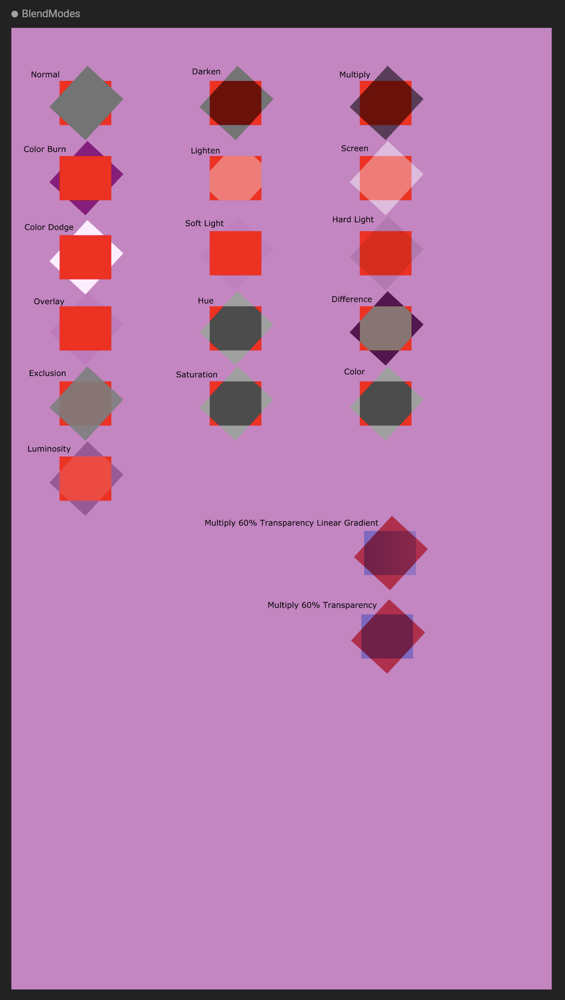
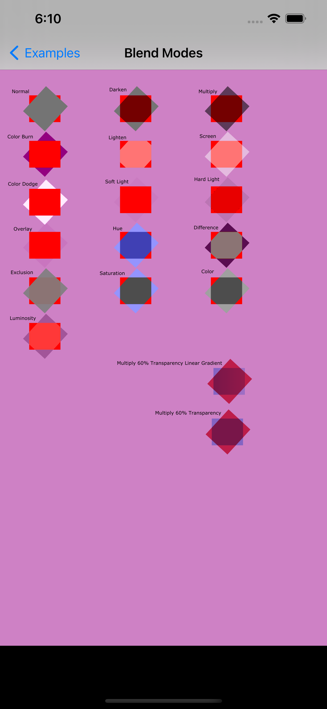

 


# rive-ios

iOS runtime for [Rive](https://rive.app/)

Further runtime documentation can be found in [Rive's help center](https://help.rive.app/runtimes).

## Create and ship interactive animations to any platform
[Rive](https://rive.app/) is a real-time interactive design and animation tool. Use our collaborative 
editor to create motion graphics that respond to different states and user inputs. Then load your animations 
into apps, games, and websites with our lightweight open-source runtimes.

## Beta Release
This is the iOS runtime for [Rive](https://rive.app), currently in beta. The api is subject to change 
as we continue to improve it. Please file issues and PRs for anything busted, missing, or just wrong.

# Installing rive-ios
## Via Cocoapods
To install our pod, simply add the following to [cocoapods](https://cocoapods.org/) and run `pod install`.

```ruby
pod 'RiveRuntime'
```

Once you have installed the pod, you can run

```swift
import RiveRuntime
```

to have access to our higher level views or build on top of our bindings to control your own animation loop.

## Via Swift Package Manager
To install via Swift Package Manager, in the package finder in xcode, search with the Github repository name: `https://github.com/rive-app/rive-ios`

# Examples
There is an example project next to the runtimes.

The examples show simple ways of adding animated views into your app, how to add buttons & slider controls, how 
to use state machines & how to navigate the contents of a rive file programatically.

To run the example, open the `Rive.xcworkspace` in Xcode and run the `RiveExample` project. Check out the 
Contributing docs to get set up. 

# Overview
We have provided high level Swift controller and a UIkit view to easily add Rive into your application. All of 
this is built ontop of an objective c layer that allows for fine grained granular animation control.

## SwiftUI

In both SwiftUI and UIKit/Storyboard usage, you import the `RiveRuntime` into your appropriate files and interface with the `RiveViewModel` to instantiate and control Rive files.

### RiveViewModel
The simplest way of adding Rive to a View is the following:

```swift
struct SwiftSimpleAnimation: DismissableView {
    var dismiss: () -> Void = {}
    
    var body: some View {
        RiveViewModel(fileName: "truck").view()
    }
}
```

Don't forget to call the `.view()` method in the View body! See additional usage below for more configuration options.

## UIKit
### RiveViewModel
The simplest way of adding Rive to a controller is to make a RiveViewModel and set its view as
the `RiveView` when it is loaded.

```swift
class SimpleAnimationViewController: UIViewController {
    @IBOutlet weak var rview: RiveView!
    
    // Load the truck_v7 resource assets
    var rSimpleVM = RiveViewModel(fileName: "truck_v7")

    override public func viewDidLoad() {
        super.viewDidLoad()
        rSimpleVM.setView(rview)
    }
}
```

Rive will autoplay the first animation found in the Rive file passed in. You can also set the Rive file via a 
URL like so:

```swift
class SimpleAnimationViewController: UIViewController {
    @IBOutlet weak var rview: RiveView!
    var rSimpleVM = RiveViewModel(webURL: "https://cdn.rive.app/animations/vehicles.riv")

    override public func viewDidLoad() {
        super.viewDidLoad()
        rSimpleVM.setView(rview)
    }
}
```

The `RiveViewModel` can be further customized to select which animation to play, or how to fit the animation 
into the view space.

### Layout
The Rive view can be further customized as part of specifying layout attributes.

`fit` can be specified to determine how the animation should be resized to fit its container. The available 
choices are: 
- `.fitFill` 
- `.fitContain`
- `.fitCover`
- `.fitFitWidth`
- `.fitFitHeight`
- `.fitNone`
- `.fitScaleDown`

`alignment` informs how it should be aligned within the container. The available choices are: 
- `alignmentTopLeft`
- `alignmentTopCenter`
- `alignmentTopRight`
- `alignmentCenterLeft`
- `alignmentCenter`
- `alignmentCenterRight`
- `alignmentBottomLeft`
- `alignmentBottomCenter`
- `alignmentBottomRight`

By default, if no `fit` or `alignment` properties are set on the `RiveViewModel`, the view will be set 
with `.fitContain` and `.alignmentCenter`.

To understand more on these options, check out the help docs [here](https://help.rive.app/runtimes/layout#fit).

To add layout options, you can set it below like:

```swift
let rSimpleVM = RiveViewModel(
    fileName: "truck_v7", 
    fit: .fitFill,
    alignment: .alignmentBottomLeft
)
```

or anytime afterwards.

```swift
rSimpleVM.fit = .fitCover
rSimpleVM.alignment = .alignmentCenter
```

### Playback Controls
Animations can be controlled in many ways. Again by default, loading a RiveViewModel will autoplay the first 
animation on the first artboard. The artboard and animation can be specified by name however if there 
are multiple artboards and/or animations defined in the Rive file.

```swift
let rMultiVM = RiveViewModel(
    riveFile: "artboard_animations",
    fit: .fitContain,
    alignment: .alignmentCenter,
    artboardName: "Square",
    animationName: "rollaround",
    autoplay: true
)
```

Furthermore animations can be controlled later too:

To play an animation named "rollaround":

```swift
rMultiVM.play(animationName: "rollaround")
```

When playing animations, the loop mode and direction of the animations can also be set:

```swift
rMultiVM.play(
    animationName: "rollaround",
    loop: .loopOneShot,
    direction: .directionBackwards
)
```

Similarly, animations can be paused or stopped.

```swift
rMultiVM.stop()
```

```swift
rMultiVM.pause()
```

### Delegates & Events
The `rive-ios` runtime allows for delegates that can be set on the `RiveViewModel`. If provided, 
these delegates will be fired whenever a matching event is triggered to be able to hook into and 
listen for certain events in the Rive animation cycle.

Currently, there exist the following delegates: 
- `RivePlayerDelegate` - Hook into animation lifecycle events
    - `loop`: `(animation animationName: String, type: Int) {}`
    - `play`: `(animation animationName: String, isStateMachine: Bool) {}`
    - `pause`: `(animation animationName: String, isStateMachine: Int) {}`
    - `stop`: `(animation animationName: String, isStateMachine: Int) {}`
- `RiveStateDelegate` - Hook into state changes on a state machine lifecycle
    - `stateChange`: `(_ stateMachineName: String, _ stateName: String) {}`
- `RiveInputDelegate` - Hook into changes to available input states
    - `inputs`: `(_ inputs: [StateMachineInput]) {}`

You can create your own delegate or mix in with the `RiveViewModel`, implementing as many protocols 
as are needed. Below is an example of how to customize a RiveViewModel's implementation of 
the `RivePlayerDelegate`:

```swift
class SimpleAnimation: RiveViewModel {
    init() {
        let model = RiveViewModel(fileName: "truck_v7", stateMachineName: "Drive")
        super.init(model)
    }
    
    override func setView(rview view: RiveView) {
        super.setView(view)
        rview?.playerDelegate = self
    }

    override func loop(animation animationName: String, type: Int) {
        // do things when the animation loops playing.
    }
    
    override func play(animation animationName: String, isStateMachine: Bool) {
        // do things when the animation starts playing.
    }

    override func pause(animation animationName: String, isStateMachine: Bool) {
        // do things when the animation is paused.
    }
    
    override func stop(animation animationName: String, isStateMachine: Bool) {
        // do things when the animation is stopped.
    }
}
```

Then you would instantiate your view model and configure it with the `RiveView` as you normally would:

```swift
class SimpleAnimationViewController: UIViewController {
    @IBOutlet weak var rview: RiveView!
    var rAnimationVM: RiveViewModel = SimpleAnimation()
    
    override func viewDidLoad() {
        super.viewDidLoad()
        rAnimationVM.setView(rview)
    }
}
```

## Blend modes 
Rive allows the artist to set blend modes on shapes to determine how they are to be merged with the
rest of the animation.

Each runtime is supporting the various blend modes natively, this means that there are some discrepancies 
in how blend modes end up being applied, we have a test file that is shipped inside the application that 
highlights the differences.

For ios, hue and saturation blend modes do not match the original.

Original | iOS             |  
:-------------------------:|:-------------------------:
 |   


## Developing `rive-ios`
please see [CONTRIBUTING.md](/CONTRIBUTING.md) for information on how to get setup and running with 
developing `rive-ios`
